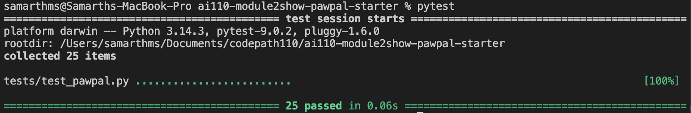
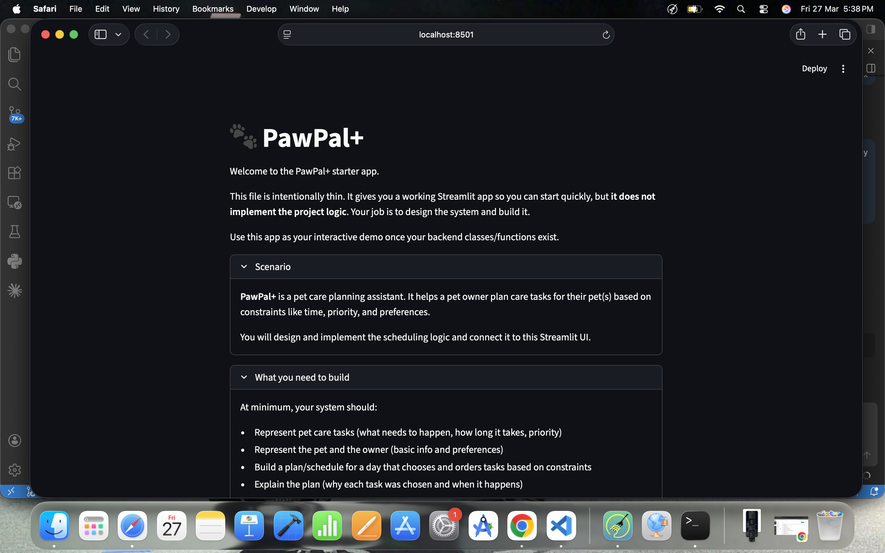
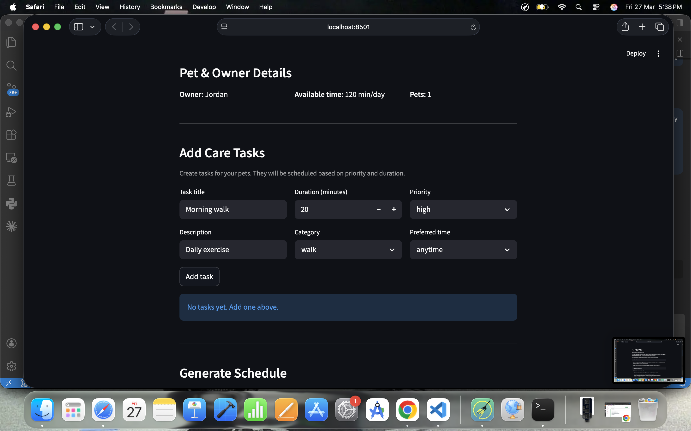
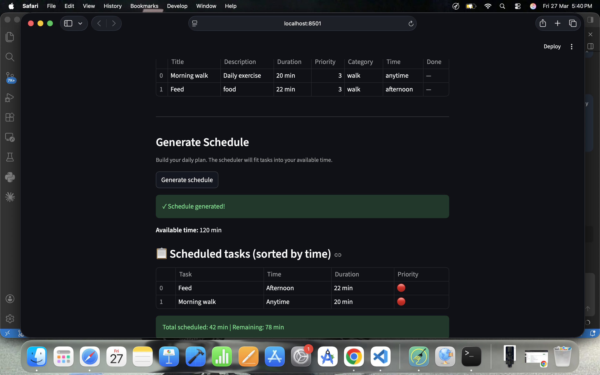
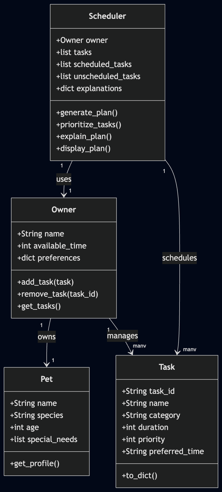
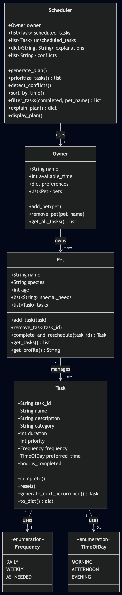

# PawPal+ (Module 2 Project)

You are building **PawPal+**, a Streamlit app that helps a pet owner plan care tasks for their pet.

## Scenario

A busy pet owner needs help staying consistent with pet care. They want an assistant that can:

- Track pet care tasks (walks, feeding, meds, enrichment, grooming, etc.)
- Consider constraints (time available, priority, owner preferences)
- Produce a daily plan and explain why it chose that plan

Your job is to design the system first (UML), then implement the logic in Python, then connect it to the Streamlit UI.

## What you will build

Your final app should:

- Let a user enter basic owner + pet info
- Let a user add/edit tasks (duration + priority at minimum)
- Generate a daily schedule/plan based on constraints and priorities
- Display the plan clearly (and ideally explain the reasoning)
- Include tests for the most important scheduling behaviors

## Features

### Scheduling Algorithms

- **Priority & Duration Sorting** — Tasks sorted by priority (high → low), then by duration (short → long) to maximize value fit into available time
- **Time-of-Day Ordering** — Groups scheduled tasks in chronological order: Morning → Afternoon → Evening → Anytime
- **Available Time Fitting** — Greedy algorithm that schedules tasks in priority order until available time is exhausted
- **Conflict Detection** — Identifies when multiple tasks are assigned to the same preferred time slot and generates actionable warnings with time requirements

### Task Recurrence & Management

- **Recurring Task Support** — Three frequency modes: DAILY, WEEKLY, and AS_NEEDED (non-recurring)
- **Auto-Rescheduling** — Completing a recurring task automatically creates a new instance for the next occurrence (with "_next" suffix in task_id)
- **Task Completion Tracking** — Marks original task complete while new instance starts pending (only for daily/weekly tasks)
- **Non-Recurring Handler** — AS_NEEDED tasks do not generate next occurrences when completed

### Filtering & Organization

- **Multi-Criteria Filtering** — Filter scheduled tasks by completion status (true/false/null) and/or pet name
- **Plan Explanations** — Provides detailed reasoning for why each task was scheduled or skipped (time constraints, priority, etc.)
- **Task Status Display** — Clear distinction between pending and completed tasks throughout the scheduler

### Data Integrity

- **Type-Safe Enums** — `Frequency` and `TimeOfDay` enums prevent invalid category values
- **Hierarchical Organization** — Owner → Pet → Task relationships ensure proper data structure and prevent orphaned data
- **Gentle Error Handling** — System gracefully handles edge cases (negative time, zero duration, duplicate IDs, missing tasks) without crashing

## Getting started

### Setup

```bash
python -m venv .venv
source .venv/bin/activate  # Windows: .venv\Scripts\activate
pip install -r requirements.txt
```

### Suggested workflow

1. Read the scenario carefully and identify requirements and edge cases.
2. Draft a UML diagram (classes, attributes, methods, relationships).
3. Convert UML into Python class stubs (no logic yet).
4. Implement scheduling logic in small increments.
5. Add tests to verify key behaviors.
6. Connect your logic to the Streamlit UI in `app.py`.
7. Refine UML so it matches what you actually built.

## Smarter Scheduling
- Consider time constraints, priorities, and user preferences.
- Implement a greedy algorithm that tries to fit tasks into preferred time slots while respecting constraints.
- Handle conflicts gracefully by generating warnings instead of crashing.
- Allow for some flexibility in scheduling based on user preferences, even if it means that not all high-priority tasks are scheduled first.
- Aim for a practical and user-friendly schedule that meets the user's needs.


## Testing Pytest

Command to run tests:

```bash
python -m pytest
```

Confidence Level: 4

The tests cover key behaviors of the scheduling logic, including task prioritization, time slot fitting, and conflict detection. They verify that tasks are scheduled according to constraints and that the system generates appropriate warnings for conflicts. However, there may still be edge cases that are not covered by the current tests, such as handling a large number of tasks or tasks with unusual time preferences. If I had more time, I would add tests for these edge cases to further increase confidence in the scheduler's robustness.
In detail, the tests include:
- Verifying that tasks are sorted correctly by priority and duration.
- Checking that tasks are grouped correctly by preferred time.
- Ensuring that filtering by completion status and pet name works as expected.
- Testing that the conflict detection logic identifies overlapping tasks and generates appropriate warnings.
Overall, while the current tests provide a good level of confidence in the core scheduling logic, there is always room for improvement by adding more comprehensive tests that cover a wider range of scenarios and edge cases



## 📸 Demo




## UML Diagrams

### Initial

### Final



