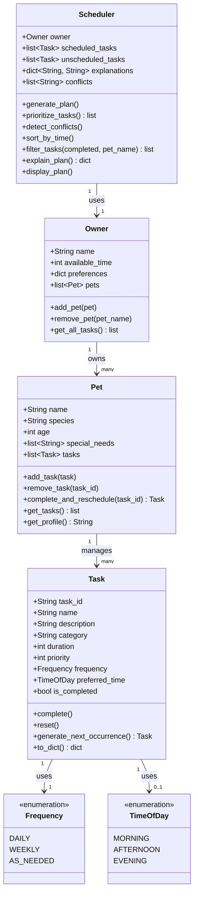

# PawPal+ UML Class Diagram

```mermaid
classDiagram
    class Frequency {
        <<enumeration>>
        DAILY
        WEEKLY
        AS_NEEDED
    }

    class TimeOfDay {
        <<enumeration>>
        MORNING
        AFTERNOON
        EVENING
    }

    class Task {
        +String task_id
        +String name
        +String description
        +String category
        +int duration
        +int priority
        +Frequency frequency
        +TimeOfDay preferred_time
        +bool is_completed
        +complete()
        +reset()
        +generate_next_occurrence() Task
        +to_dict() dict
    }

    class Pet {
        +String name
        +String species
        +int age
        +list~String~ special_needs
        +list~Task~ tasks
        +add_task(task)
        +remove_task(task_id)
        +complete_and_reschedule(task_id) Task
        +get_tasks() list
        +get_profile() String
    }

    class Owner {
        +String name
        +int available_time
        +dict preferences
        +list~Pet~ pets
        +add_pet(pet)
        +remove_pet(pet_name)
        +get_all_tasks() list
    }

    class Scheduler {
        +Owner owner
        +list~Task~ scheduled_tasks
        +list~Task~ unscheduled_tasks
        +dict~String, String~ explanations
        +list~String~ conflicts
        +generate_plan()
        +prioritize_tasks() list
        +detect_conflicts()
        +sort_by_time()
        +filter_tasks(completed, pet_name) list
        +explain_plan() dict
        +display_plan()
    }

    Owner "1" --> "many" Pet : owns
    Pet "1" --> "many" Task : manages
    Scheduler "1" --> "1" Owner : uses
    Task "1" --> "1" Frequency : uses
    Task "1" --> "0..1" TimeOfDay : uses
```

