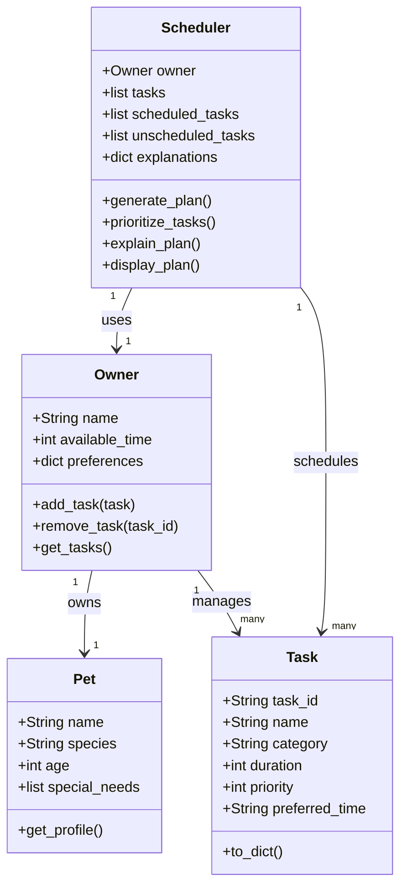

# PawPal+ UML Class Diagram

```mermaid
classDiagram
    class Owner {
        +String name
        +int available_time
        +dict preferences
        +add_task(task)
        +remove_task(task_id)
        +get_tasks()
    }

    class Pet {
        +String name
        +String species
        +int age
        +list special_needs
        +get_profile()
    }

    class Task {
        +String task_id
        +String name
        +String category
        +int duration
        +int priority
        +String preferred_time
        +to_dict()
    }

    class Scheduler {
        +Owner owner
        +list tasks
        +list scheduled_tasks
        +list unscheduled_tasks
        +dict explanations
        +generate_plan()
        +prioritize_tasks()
        +explain_plan()
        +display_plan()
    }

    Owner "1" --> "1" Pet : owns
    Owner "1" --> "many" Task : manages
    Scheduler "1" --> "1" Owner : uses
    Scheduler "1" --> "many" Task : schedules
```
